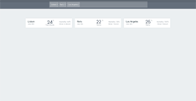

# Project Title

Accu Weather API


## Screenshot



## Getting Started

Follow these steps to get you started after cloning the repo:

```
cd acu_weather_api

npm install
```

After npm finishes with installation of dependencies, just start the project on localhost:

```
npm start
```


The project should start in port 3000 if it's available

### Prerequisites

... will be installed with 

```
npm install
```


